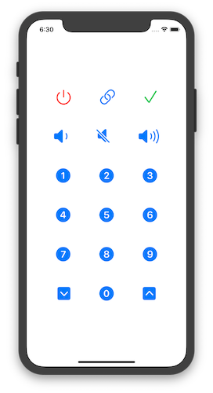
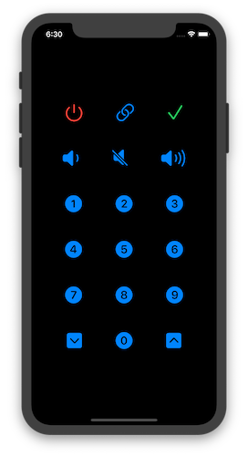
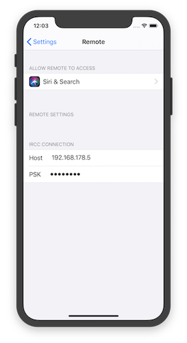

# iOS Bravia Remote

SwiftUI based iOS app to remote control a Sony Bravia TV via IRCC.

Actually just a playground for myself 😅

## Screenshots

## Licence

The application is available as open source under the terms of the MIT License.
